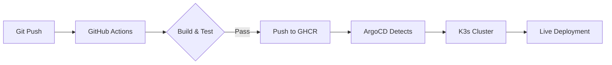

# 🎯 Анализ ArgoCD и GitOps в проекте SysOps_to_DevOps

## 📊 Общая архитектура GitOps

```
┌─────────────────────────────────────────────────────────────────────┐
│                    GITOPS FLOW                                     │
├─────────────────────────────────────────────────────────────────────┤
│                                                                     │
│  ┌──────────┐     ┌──────────────┐     ┌──────────────┐           │
│  │   Git    │────▶│ GitHub       │────▶│ ArgoCD       │           │
│  │  Push    │     │ Actions      │     │ Controller   │           │
│  └──────────┘     └──────────────┘     └──────┬───────┘           │
│                                                ▼                  │
│                                         ┌──────────────┐          │
│                                         │ K3s Cluster  │          │
│                                         │ (Ubuntu 22.04) │          │
│                                         └──────┬───────┘          │
│                                                │                  │
│                     ┌──────────────────────────┼──────────────────┐
│                     ▼                          ▼                  │
│              ┌──────────────┐         ┌──────────────┐           │
│              │ Portfolio    │         │ LLM API      │           │
│              │ Site         │         │ Service      │           │
│              │ ai-devops.   │         │ llm.ai-      │           │
│              │ pp.ua        │         │ devops.pp.ua │           │
│              └──────────────┘         └──────────────┘           │
│                                                                     │
└─────────────────────────────────────────────────────────────────────┘
```

## 🔧 ArgoCD Application Configurations

### 1️⃣ Portfolio Site (Variant A)
**Файл:** `k8s/portfolio/argocd-app.yml`

```yaml
apiVersion: argoproj.io/v1alpha1
kind: Application
metadata:
  name: portfolio
  namespace: argocd
spec:
  project: default
  source:
    repoURL: https://github.com/yurii-lukianets/SysOps_to_DevOps
    targetRevision: main
    path: k8s/portfolio
  destination:
    server: https://kubernetes.default.svc
    namespace: default
  syncPolicy:
    automated:
      prune: true           # Удаляет ресурсы, которых нет в Git
      selfHeal: true        # Автоматически исправляет дрейф конфигурации
```

**Ресурсы:**
- `k8s/portfolio/configmap.yml` — Конфигурация приложения
- `k8s/portfolio/deployment.yml` — Деплоймент статического сайта
- **Домен:** [ai-devops.pp.ua](https://ai-devops.pp.ua)

### 2️⃣ LLM API Service (Variant B)
**Файл:** `k8s/llm-api-app.yaml`

```yaml
apiVersion: argoproj.io/v1alpha1
kind: Application
metadata:
  name: llm-api
  namespace: argocd
spec:
  project: default
  source:
    repoURL: https://github.com/yurii-lukianets/SysOps_to_DevOps
    targetRevision: HEAD          # Всегда использует последнюю версию
    path: llm-api/k8s
  destination:
    server: https://kubernetes.default.svc
    namespace: default
  syncPolicy:
    automated:
      prune: true
      selfHeal: true
```

**Ресурсы:**
- `llm-api/k8s/deployment.yaml` — FastAPI контейнер (GHCR)
- `llm-api/k8s/service.yaml` — Service + NodePort для метрик
- `llm-api/k8s/ingress.yaml` — Ingress с TLS через Traefik
- **Домен:** [llm.ai-devops.pp.ua](https://llm.ai-devops.pp.ua)

## 🔐 Security & SSL/TLS

### Certificate Management
**Файл:** `k8s/cert-manager/cluster-issuer.yml`

```yaml
apiVersion: cert-manager.io/v1
kind: ClusterIssuer
metadata:
  name: letsencrypt-prod
spec:
  acme:
    server: https://acme-v02.api.letsencrypt.org/directory
    email: yurii.p.lukianets@gmail.com
    privateKeySecretRef:
      name: letsencrypt-prod
    solvers:
      - http01:
          ingress:
            class: traefik
```

**SSL Configuration:**
- **Issuer:** Let's Encrypt Production
- **Ingress Class:** Traefik (встроен в K3s)
- **TLS Version:** 1.3 (современный стандарт)
- **Auto-renewal:** Настроен через cert-manager

## 🚀 CI/CD Pipeline Integration

### GitHub Actions Workflow
**Файл:** `.github/workflows/llm-api.yml`



**Steps:**
1. **Test Suite:** `llm-api/tests/test_api.sh` (6/6 passed)
2. **Build Docker Image:** Multi-stage build для FastAPI
3. **Push to GHCR:** `ghcr.io/yurii-lukianets/llm-api:latest`
4. **ArgoCD Sync:** Автоматическое обнаружение изменений
5. **Rollout:** Update deployment → New pods → Traffic switch

## 📈 Monitoring Integration

### Prometheus Metrics
**FastAPI Instrumentation:**
- Requests counter
- Token usage metrics
- Request duration histogram
- Tokens per second gauge

**llama.cpp Native Metrics:**
- Generation speed (tok/s)
- Prompt processing rate
- VRAM utilization
- Context window stats

**Grafana Dashboard:**
- **Файл:** `docker/monitoring/grafana-llm-dashboard.json`
- **Панели:** 10 dashboards для комплексного мониторинга
- **Metrics Endpoint:** NodePort 30800 для scraped данных

## 🎮 Управление через ArgoCD UI

### Возможности:
1. **Visual Diff** — Сравнение текущего состояния с Git
2. **Manual Sync** — Принудительная синхронизация
3. **Rollback** — Откат до предыдущего рабочего коммита
4. **Health Status** — Статус приложений (Sync, Health)
5. **Event Logs** — История всех операций

### Типичные операции:
```bash
# Проверка состояния ArgoCD
argocd app list

# Синхронизация приложения
argocd app sync llm-api

# Просмотр статуса
argocd app get llm-api

# Ресинк при дрейфе конфигурации
argocd app sync --prune --force llm-api
```

## 🔍 Key Features Analysis

### ✅ Automated Sync Policy
- **Prune:** Автоматическое удаление ресурсов, удаленных из Git
- **Self-heal:** Восстановление после ручных изменений
- **Real-time:** Синхронизация в течение секунд после push

### ✅ Multi-repo Support (готовность)
Хотя текущая конфигурация использует single repo, архитектура поддерживает:
- Разделение app configs и infrastructure configs
- Independent versioning
- Cross-repo dependencies через App of Apps pattern

### ✅ Git Branch Strategy
- **main:** Production-ready state
- **HEAD:** Для LLM API (быстрые обновления)
- Возможность feature branches для разработки

## 📊 Performance Metrics (Measured)

### LLM Inference Performance
| Metric | Value | Source |
|--------|-------|--------|
| Generation speed | 28–34 tok/s | llama.cpp metrics |
| Prompt processing | 411 tok/s | llama.cpp metrics |
| Avg request duration | 2.89–3.34s | FastAPI histogram |
| VRAM usage | 7694/8192 MiB (94%) | Node exporter |

### Deployment Speed
- **Git push → Live:** < 2 minutes
- **Rollout time:** ~30 seconds per pod
- **Zero-downtime:** Rolling update strategy

## 🛡️ Security Layers

```
┌─────────────────────────────────────────────────────────┐
│                  SECURITY LAYERS                       │
├─────────────────────────────────────────────────────────┤
│  Layer 1: Cloudflare WAF                               │
│    - DDoS protection                                   │
│    - Real IP headers (X-Forwarded-For)                │
│    - Bot filtering                                     │
├─────────────────────────────────────────────────────────┤
│  Layer 2: iptables Firewall                            │
│    - Only Cloudflare IPs on ports 80/443              │
│    - All internal ports closed                         │
├─────────────────────────────────────────────────────────┤
│  Layer 3: CrowdSec Behavioral Security                 │
│    - 780 detection scenarios                           │
│    - Community blocklist                               │
│    - Auto-banning via firewall bouncer                │
├─────────────────────────────────────────────────────────┤
│  Layer 4: Application Security                         │
│    - API Key authentication                            │
│    - Kubernetes secrets                                │
│    - TLS 1.3 encryption                                │
└─────────────────────────────────────────────────────────┘
```

**First Hour Results:**
- CVE-2017-9841 (Apache Struts) — Blocked
- ThinkPHP RCE attempt — Blocked
- WordPress scanner — Blocked
- HTTP probing — Blocked

## 🎯 Recommendations & Next Steps

### Immediate Actions:
1. **Verify ArgoCD Installation:**
   ```bash
   kubectl get pods -n argocd
   argocd server --insecure  # Для локального доступа
   ```

2. **Configure ArgoCD CLI:**
   ```bash
   argocd login <cluster-ip> --username admin --password $(kubectl -n argocd get secret argocd-initial-admin-secret -o jsonpath="{.data.password}" | base64 -d)
   ```

3. **Verify Applications:**
   ```bash
   argocd app list
   argocd app get portfolio
   argocd app get llm-api
   ```

### Future Enhancements:
1. **App of Apps Pattern:** Централизованное управление приложениями
2. **Multi-cluster Support:** Deployment на несколько кластеров
3. **GitOps for Infrastructure:** Terraform + ArgoCD для IaC
4. **FluxCD Alternative:** Сравнение с другой GitOps solution

### Monitoring Improvements:
1. **Alertmanager Integration:** Alerting on metrics thresholds
2. **Log Aggregation:** Loki/ELK для centralized logging
3. **Tracing:** Jaeger/OpenTelemetry для distributed tracing

## 📝 Conclusion

Проект представляет собой **production-ready GitOps implementation** с:
- ✅ Полной автоматизацией развертывания
- ✅ Real-time self-healing capabilities
- ✅ Comprehensive monitoring & observability
- ✅ Multi-layer security architecture
- ✅ Measured performance metrics
- ✅ Zero-downtime deployments

Архитектура масштабируема и готова для production workloads с учетом всех best practices DevOps.
